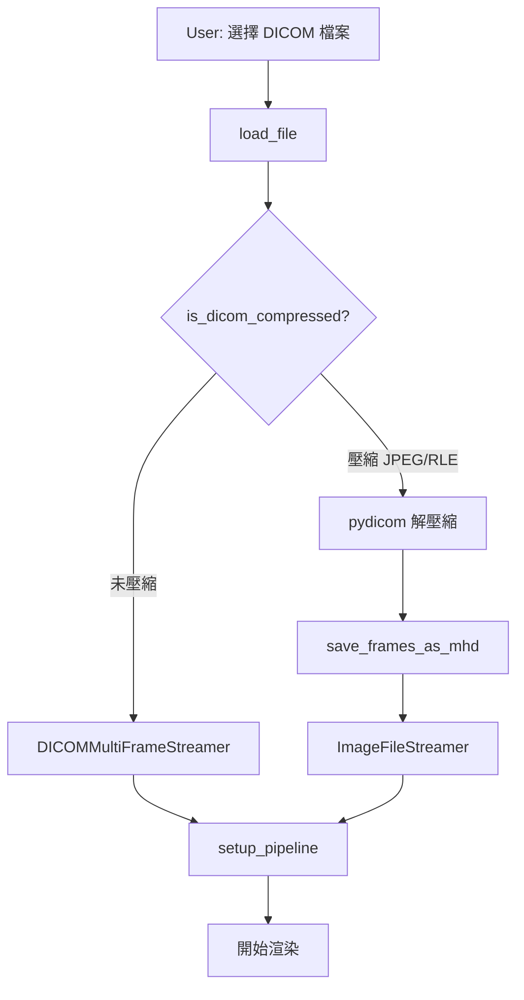
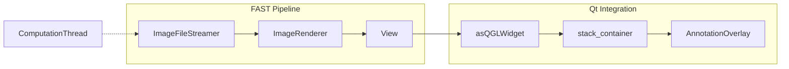
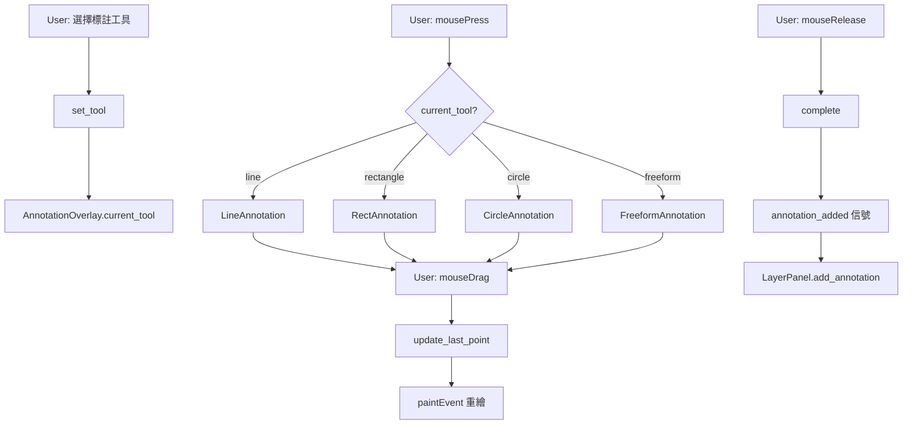
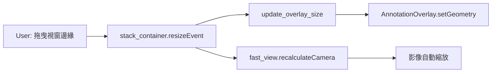
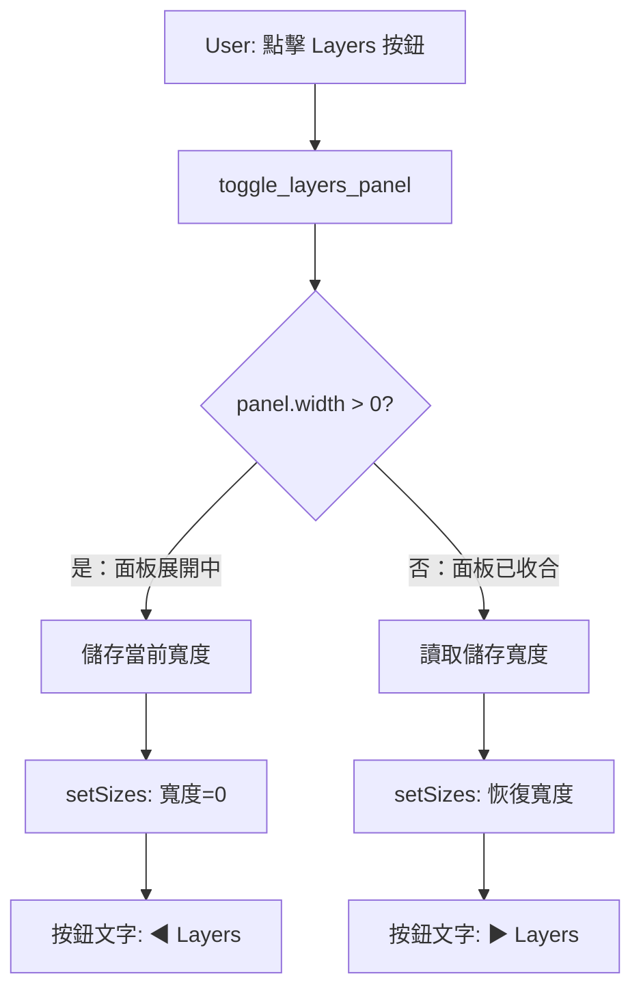

# 超音波影像軟體 (Ultrasound Imaging Software)

基於 FAST Framework 和 PySide2 的專業醫學影像檢視應用程式。

---

## 1. 專案架構

```
ultrasound_app/
├── main.py                 # 入口點，命令列參數解析
├── requirements.txt        # 依賴項
├── verify_install.py       # 環境驗證腳本
├── inspect_dicom.py        # DICOM 檔案檢測工具
├── assets/
│   └── fonts/              # 圖標字體 (Lucide, Material Symbols)
└── src/
    ├── __init__.py
    ├── qt_gui.py           # 主 GUI 視窗 (PySide2)
    ├── annotations.py      # 標註系統 (繪圖工具)
    ├── pipelines.py        # FAST 串流管道
    └── gui.py              # 簡易 FAST GUI (備用)
```

---

## 2. 核心模組說明

### 2.1 `main.py` — 應用程式入口

| 功能 | 說明 |
|------|------|
| 命令列參數 | `--qt` (專業 GUI), `--file` (檔案路徑), `--stream` (串流模式) |
| Qt GUI 模式 | 調用 `src.qt_gui.run_qt_app()` |
| 簡易模式 | 調用 `src.gui.UltrasoundWindow` |

---

### 2.2 `src/qt_gui.py` — 主 GUI 視窗

```
┌─────────────────────────────────────────────────────────────────┐
│                        ToolbarWidget                            │
│  [Pan] [Zoom] [Reset] [Rotate] [Annotate▼] [Play] [Screenshot]  │
├───────────┬────────────────────────────────────┬────────────────┤
│           │                                    │                │
│ FileList  │       FAST View + Overlay          │  LayerPanel    │
│ Widget    │     (stack_container)              │   Widget       │
│           │                                    │                │
├───────────┴────────────────────────────────────┴────────────────┤
│                     PlaybackControlWidget                       │
│           [Play] ──────────────────────── Frame: 1/100          │
└─────────────────────────────────────────────────────────────────┘
```

**核心類別：**

| 類別 | 職責 |
|------|------|
| `UltrasoundViewerWindow` | 主視窗，整合所有元件 |
| `ToolbarWidget` | 工具列（Pan, Zoom, Annotate 等） |
| `FileListWidget` | 左側檔案列表面板 |
| `PlaybackControlWidget` | 底部播放控制欄 |

---

### 2.3 `src/annotations.py` — 標註系統

**標註類別繼承結構：**

```
Annotation (基類)
├── LineAnnotation      # 線條，計算長度
├── RectAnnotation      # 矩形，計算寬/高/面積
├── CircleAnnotation    # 圓形，計算半徑/面積
└── FreeformAnnotation  # 自由繪製，計算路徑長度
```

**UI 元件：**

| 類別 | 職責 |
|------|------|
| `AnnotationOverlay` | 透明疊加層，處理滑鼠事件繪製標註 |
| `LayerPanelWidget` | 右側圖層面板，顯示所有標註 |
| `LayerItemWidget` | 單一標註項目（可見性、刪除） |

---

### 2.4 `src/pipelines.py` — FAST 串流管道

| 函數 | 說明 |
|------|------|
| `create_playback_pipeline(filepath)` | 建立 DICOM/影片播放管道 |
| `is_dicom_compressed(filepath)` | 檢測 DICOM 壓縮格式 |
| `save_frames_as_mhd(arr, temp_dir)` | 將 numpy 陣列存為 MHD 檔供 FAST 讀取 |
| `NumpyImageSource` | 自訂 FAST Process，從 numpy 陣列串流 |

---

### 2.5 `src/image_processing.py` — 影像處理模組 (v2.0 新增)

**色彩映射管理器：**

| 類別 | 說明 |
|------|------|
| `ColormapManager` | 管理 LUT 查找表，支援多種色彩映射 |
| `ColormapType` | 支援的色彩映射類型枚舉 |

**支援的色彩映射：**
- `GRAYSCALE` - 標準灰階
- `HOT` - 熱力圖 (黑→紅→黃→白)
- `COOL` - 冷色調 (青→洋紅)
- `BONE` - 骨骼 (醫學影像常用)
- `VIRIDIS` - 色盲友善
- `PLASMA` - 等離子
- `INFERNO` - 地獄火

**濾波器處理器：**

| 類別 | 說明 |
|------|------|
| `ImageFilterProcessor` | 影像濾波器處理 |
| `FilterType` | 支援的濾波器類型枚舉 |

**支援的濾波器：**
- `NONE` - 無濾波
- `GAUSSIAN` - 高斯模糊 (平滑)
- `MEDIAN` - 中值濾波 (椒鹽雜訊)
- `SHARPEN` - 銳化 (Unsharp Mask)
- `EDGE_ENHANCE` - 邊緣增強 (Laplacian)
- `SPECKLE_REDUCE` - 斑點降噪 (Lee Filter)

---

## 3. 關鍵功能流程

### 3.1 載入 DICOM 檔案

開啟 DICOM 檔案時，系統會自動偵測壓縮格式並選擇合適的載入方式：



**載入流程說明：**

| 步驟 | 函數/元件 | 說明 |
|------|-----------|------|
| 1 | `load_file(filepath)` | 入口，接收檔案路徑 |
| 2 | `is_dicom_compressed()` | 檢測 Transfer Syntax UID 判斷壓縮類型 |
| 3a | `DICOMMultiFrameStreamer` | FAST 原生讀取未壓縮 DICOM |
| 3b | `pydicom.dcmread()` | Python 解壓縮 JPEG/RLE 格式 |
| 4 | `save_frames_as_mhd()` | 將 numpy 陣列存為 MHD 暫存檔 |
| 5 | `setup_pipeline()` | 建立 FAST 渲染管道 |

**關鍵程式碼：**

```python
# pipelines.py - create_playback_pipeline()
is_compressed, ts_uid, ts_name = is_dicom_compressed(filepath)

if not is_compressed:
    streamer = fast.DICOMMultiFrameStreamer.create(filepath, loop)
else:
    # 使用 pydicom 解壓縮
    ds = pydicom.dcmread(filepath)
    arr = ds.pixel_array  # 自動解壓縮
    pattern = save_frames_as_mhd(arr, temp_dir)
    streamer = fast.ImageFileStreamer.create(pattern, loop, framerate)
```

---

### 3.2 超音波影像渲染

載入 DICOM 後，FAST 會建立渲染管道將影像顯示在 Qt 視窗中：



**渲染流程說明：**

| 步驟 | 元件 | 說明 |
|------|------|------|
| 1 | `ImageFileStreamer` | 從 MHD 檔案串流影格，根據 framerate 控制播放速度 |
| 2 | `ImageRenderer` | 將影像資料轉換為 OpenGL 紋理 |
| 3 | `View` | FAST 的 OpenGL 視圖，處理相機、縮放、平移 |
| 4 | `asQGLWidget()` | 將 FAST View 包裝為 Qt QGLWidget |
| 5 | `stack_container` | 使用 QStackedLayout 疊加 FAST 視圖和標註層 |
| 6 | `AnnotationOverlay` | 透明 Widget 疊加在影像上方，處理繪圖 |

**關鍵程式碼：**

```python
# qt_gui.py - setup_pipeline()
self.renderer = fast.ImageRenderer.create()
self.renderer.setInputConnection(self.current_streamer.getOutputPort())

self.fast_view.addRenderer(self.renderer)

# 背景執行緒持續執行管道
self.computation_thread = fast.ComputationThread.create(fast.Window())
self.computation_thread.addView(self.fast_view)
self.computation_thread.start()
```

---

### 3.3 標註繪製流程

使用者可在超音波影像上繪製各種標註（線條、矩形、圓形、自由繪製）：



**標註流程說明：**

| 步驟 | 方法 | 說明 |
|------|------|------|
| 1 | `set_tool(tool_name)` | 設定當前繪圖工具 |
| 2 | `mousePressEvent()` | 建立對應的 Annotation 物件 |
| 3 | `mouseMoveEvent()` | 更新標註終點，觸發重繪 |
| 4 | `mouseReleaseEvent()` | 完成標註，計算測量值 |
| 5 | `annotation_added` | 發送信號通知 LayerPanel |
| 6 | `add_annotation()` | 在圖層面板新增項目 |

**關鍵程式碼：**

```python
# annotations.py - AnnotationOverlay.mousePressEvent()
if self.current_tool == 'line':
    self.current_annotation = LineAnnotation(self.annotation_color)
elif self.current_tool == 'rectangle':
    self.current_annotation = RectAnnotation(self.annotation_color)

self.current_annotation.add_point(event.pos())
self.annotations.append(self.current_annotation)
```

---

### 3.4 視窗縮放自動適配

當視窗大小改變時，超音波影像會即時縮放以填滿可用空間：



**自動適配流程說明：**

| 步驟 | 方法 | 說明 |
|------|------|------|
| 1 | `resizeEvent` | Qt 視窗大小改變事件 |
| 2 | `update_overlay_size()` | 同步調整標註層尺寸 |
| 3 | `recalculateCamera()` | FAST API 重新計算相機邊界 |
| 4 | OpenGL 重繪 | 影像按新視口比例顯示 |

**關鍵程式碼：**

```python
# qt_gui.py - on_resize()
def on_resize(event):
    update_overlay_size()
    # Direct API call for instant camera recalculation
    if self.fast_view and self.current_streamer:
        try:
            self.fast_view.recalculateCamera()
        except:
            pass

stack_container.resizeEvent = on_resize
```

---

### 3.5 圖層面板收合/展開

工具列的 Layers 按鈕可控制右側圖層面板的顯示/隱藏：



**收合/展開流程說明：**

| 步驟 | 方法 | 說明 |
|------|------|------|
| 1 | `layers_toggle_action.triggered` | 工具列按鈕點擊信號 |
| 2 | `toggle_layers_panel()` | 切換面板可見性 |
| 3 | `main_splitter.sizes()` | 取得各面板當前寬度 |
| 4 | `setSizes([...])` | 設定新的寬度配置 |
| 5 | `setText()` | 更新按鈕圖標方向 |

**關鍵程式碼：**

```python
# qt_gui.py - toggle_layers_panel()
def toggle_layers_panel(self):
    sizes = self.main_splitter.sizes()
    
    if sizes[2] > 0:
        # 收合：儲存寬度並設為 0
        self._saved_layer_width = sizes[2]
        sizes[2] = 0
        self.toolbar.layers_toggle_action.setText("◀ Layers")
    else:
        # 展開：恢復儲存的寬度
        sizes[2] = getattr(self, '_saved_layer_width', 300)
        self.toolbar.layers_toggle_action.setText("▶ Layers")
    
    self.main_splitter.setSizes(sizes)
```

---

## 4. 依賴項

| 套件 | 版本 | 用途 |
|------|------|------|
| FAST | 4.15.1 | 醫學影像處理框架 |
| PySide2 | 5.15.2.1 | Qt GUI 綁定 |
| pydicom | 2.4.4 | DICOM 檔案讀取/解壓縮 |
| numpy | 2.0.2 | 數值運算 |
| pylibjpeg | 2.0.1 | JPEG 解壓縮 |
| pylibjpeg-libjpeg | 2.3.0 | JPEG 解壓縮 |
| pylibjpeg-openjpeg | 2.5.0 | JPEG 解壓縮 |
| shiboken2 | 5.15.15 | PySide2 綁定 |
| PySide2 | 5.15.15 | Qt GUI 綁定 |
| h5py | 3.14.0 | MHD 檔案存取 |
| pillow | 11.3.0 | 圖片處理 |
| pyfast | 4.15.1 | 醫學影像處理框架 |
|
---

## 5. 啟動方式

```bash
# 專業 Qt GUI（推薦）
python main.py --qt --file /path/to/ultrasound.dcm

# 簡易 FAST GUI
python main.py --file /path/to/ultrasound.dcm

# Qt GUI（無檔案，使用對話框開啟）
python main.py --qt
```
